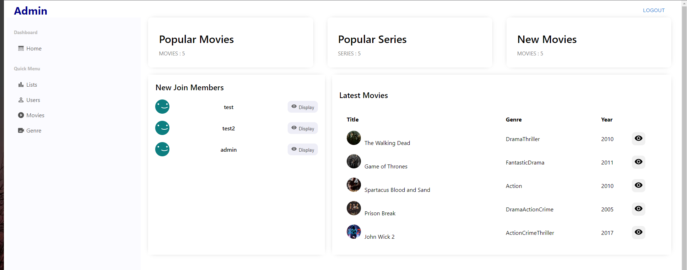
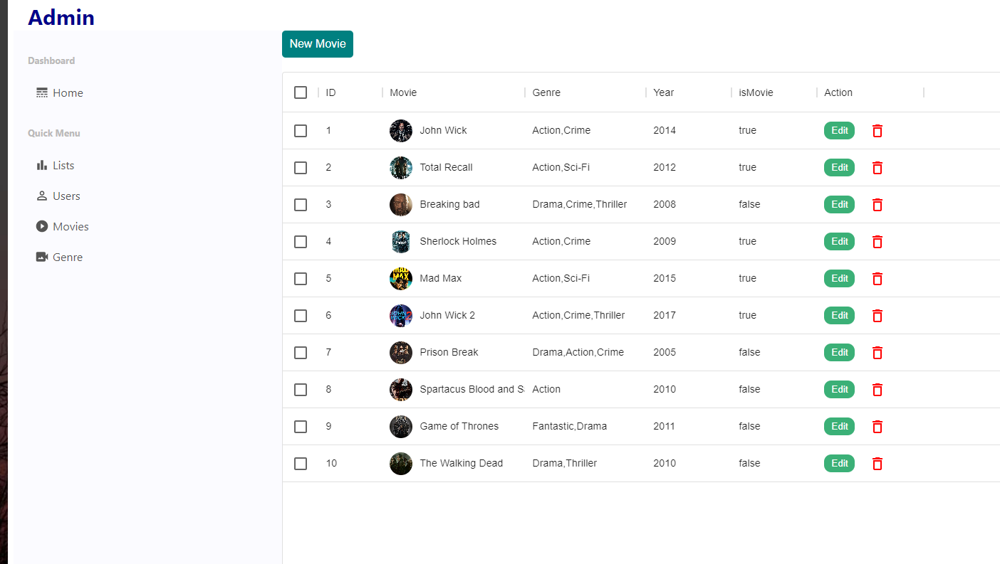
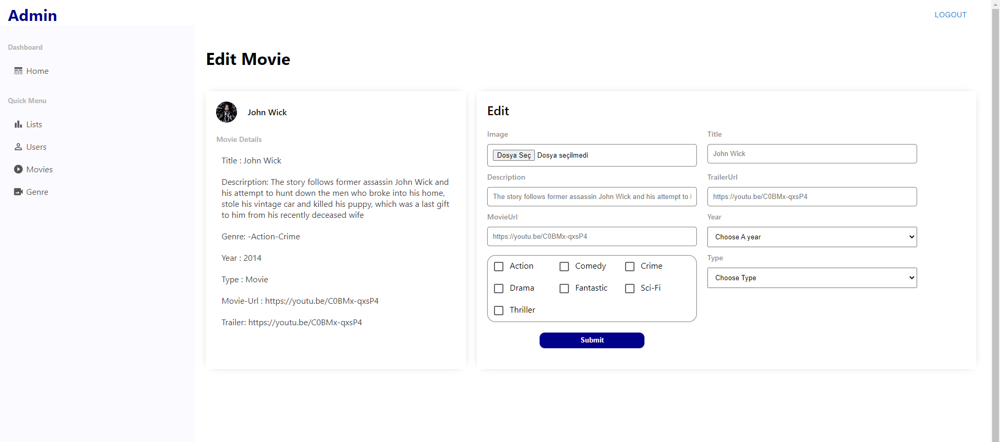

### <b>Live Admin-Page</b> : <a href="https://spring-boot-next-js-netflix-clone-erkt.vercel.app/login"> admin-page</a><br/>


## Admin Page

This is a Next.js project 


Admin will be able to do:  <b> Add- Edit-Delete:
<ul>
  <li>Movie</li>
  <li>Genre</li>
  <li>User</li>
  <li>List for movies</li>
</ul>

### images





## Getting Started

First, run the development server:

```bash
npm run dev
# or
yarn dev
```

Open [http://localhost:3000](http://localhost:3000) with your browser to see the result.


